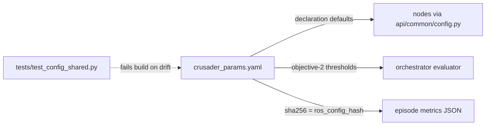

# `config/` — single source of truth for runtime configuration

| File | Role |
|---|---|
| `crusader_params.yaml` | **THE source of truth for all ROS-side parameters** (Phase 3.5). Standard ROS 2 params-file format. YAML anchors tie values that must stay equal across nodes (e.g. `occupied_threshold` grid↔APF; progress-monitor thresholds node↔evaluator). Its sha256 is recorded as `ros_config_hash` in every episode metrics JSON. |
| `crusader_devices.json` | Per-boat device topology with stable `/dev/crsd-*` symlinks (generated alongside the udev rules by `tools/udev/gen_udev_rules.py`). Consumers open the symlink directly. |

ArduRover-side parameters live in `working_crusader_params.params` on the boat/drive (the
known-good file) — **not** in this directory. `tools/scripts/param_guard.py` diffs live
params against it and hard-fails on the protected set.

## Parameter posture (enforced in code, `api/common/param_utils.py`)

- **`[RO]` read_only** — safety/structural (telemetry_bridge safety params, grid geometry,
  engine path, monitor thresholds). `ros2 param set` is rejected loudly. Change = edit YAML +
  restart node (no rebuild; params load at start).
- **`[DYN]` dynamic** — range-validated and actually applied at runtime (APF gains,
  conf_threshold, decay_tau, health budgets). This is the knob path for test-day tuning and
  the Level-1 loop.

There is deliberately no third posture: "declared-but-ignored" no longer exists anywhere.

## How a param change propagates

## Change-impact map

| If you edit… | Then |
|---|---|
| a `[DYN]` value | restart node (or `ros2 param set` live); episode metrics hash changes — results before/after are not comparable rows |
| a `[RO]` value | restart node; if it's a safety param, needs review vs CLAUDE.md standing constraints |
| a **YAML anchor** value | you changed BOTH the node and the evaluator — run `tests/test_config_shared.py` and the G3/G4 gates |
| `crusader_devices.json` | regenerate udev rules (`tools/udev/gen_udev_rules.py`), reinstall, replug |
