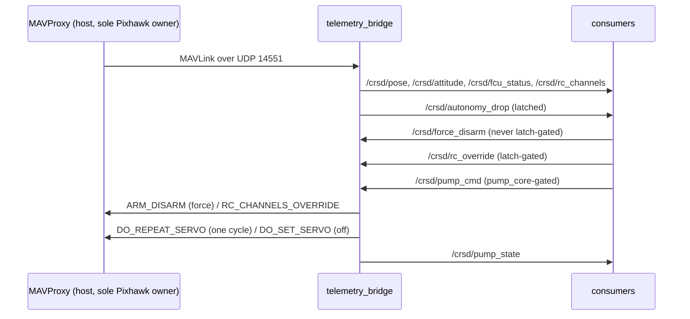

# `crusader_fcu` — the autopilot gateway

One node, `telemetry_bridge`, and it is the **only** thing in the workspace that speaks
MAVLink. In the architecture diagram it sits in two places at once: it is the
**Localization** source (pose out of the Pixhawk's EKF) *and* the **Movement** actuator
(force-disarm, RC override). That is why it is its own package rather than filed under
either domain.

## Topics



## Three rules enforced in code

**One Pixhawk owner.** The node raises at startup if `mav_endpoint` is not udp/tcp, so it
cannot be pointed at the serial device. MAVProxy owns that; everything else consumes the
rebroadcast.

**Silence stays silent.** Each RX stream is republished *only while fresh*. Replaying the
last cached frame with a new timestamp makes a dead MAVProxy indistinguishable from a
healthy one — which silently disables both of the watchdog's detection paths.

**Force-disarm is never latch-gated.** `_force_disarm_cb` must not consult
`latch.allowed`. Gating it would make an RC-loss kill impossible in exactly the situation
that produces one.

## Attitude is a separate topic, and its rate is set outside this repo

`/crsd/attitude` carries roll/pitch/yaw for mission-element mapping — without
roll and pitch a camera bearing is only correct on flat water. It is a topic of
its own rather than three more fields on `LatLonHead` because `ATTITUDE` and
`GLOBAL_POSITION_INT` are different MAVLink streams (EXTRA1 vs POSITION) and can
die independently; merging them would let one stream's staleness silently vouch
for the other.

**Target rate: 30 Hz, to match the camera.** Two things had to change for that
number to be real, and both are outside this node:

| Where | What | Why |
|---|---|---|
| QGroundControl → `SR0_EXTRA1` = **30** | the stream that carries `ATTITUDE`. USB is `SERIAL0`, which is the port MAVProxy opens | per-stream, so `RAW_SENS`/`PARAMS` stay low instead of every stream lifting at once |
| [`scripts/start_mavproxy.sh`](../scripts/start_mavproxy.sh) → `--streamrate=-1` | stops MAVProxy requesting streams at all | **without this the QGC setting does nothing** |

That second row is the trap. MAVProxy sends
`REQUEST_DATA_STREAM(MAV_DATA_STREAM_ALL, 4Hz)` on every connect *and every
reconnect*, and ArduPilot applies it to `SR0_*` in RAM without saving. So a rate
set in QGC is written to EEPROM, still reads 30 in QGC afterwards, and is
silently stomped back to 4 Hz the next time `crsd-mavproxy` restarts. `-1` means
"request nothing, leave the vehicle's own rates alone".

**Attitude publishes on arrival, not on the 20 Hz tick.** Resampling 30 Hz onto
a 20 Hz tick drops one frame in three and shifts the rest by up to 50 ms — ~6°
at a 2 rad/s roll, which is most of the error roll/pitch compensation exists to
remove. The other three topics keep the tick: they carry the latest known
*state*, where a repeat is harmless and the freshness gate is what matters.

Confirm it on the boat rather than assuming — `SR0_EXTRA1` is capped by the
autopilot's scheduler loop, and a Pixhawk1-class board will not always deliver a
clean 30:

```bash
ros2 topic hz /crsd/attitude
```

After setting it, re-export `params/working_crusader.params` from QGC. `SR0_*`
is not in `param_guard`'s PROTECTED list, so preflight reports the change as a
tunable warning rather than failing — but a stale baseline is how a real drift
later gets waved through as noise.

## The water pump (`pump_core.py`)

Task 3's pump is on a Pixhawk output that passes the pilot's pump switch through
(ch10, `SERVOn_FUNCTION=60`). `/crsd/pump_cmd` asks for a burst; the bridge sends it
as **`MAV_CMD_DO_REPEAT_SERVO` with one cycle**, so the **autopilot** returns the
output to `SERVOn_TRIM` when the burst is over — whatever happens to this node, the
laptop or the WiFi. That makes **`SERVOn_TRIM` = pump OFF a safety requirement**;
`check_config` fails a baseline where it is not.

The bridge refuses a burst unless: a pump output is configured (`pump_servo_channel`,
**0 until [G7](../docs/G7_pump_bench.md) is signed**), RC is fresh, SB is not in
e-stop, the pilot's switch is OFF, the vehicle is armed (`pump_allow_disarmed` only
by a `-p` override on the bench), the output reads OFF, and the gap since the last
burst has passed. OFF (`duration_s: 0`) is never refused.

**The SB e-stop stops motors, not a pass-through output.** So the 20 Hz tick runs a
watchdog: pump ON with SB in e-stop or RC lost → `DO_SET_SERVO` OFF (once a second).
Pump still ON 0.3 s after one of our bursts should have ended → OFF, and the pump
path **latches off** until the bridge restarts: TRIM is probably not OFF, and that is
a thing to look at, not to retry.

Not mode-gated and not latch-gated: it moves water, not the boat. `pump_core` has no
ROS and no MAVLink; `python3 crusader_fcu/test/test_pump_core.py` runs every rule.

## Note on the RC-override path

Nothing in this repo currently publishes `/crsd/rc_override`. The path and its latch are
the Gate G1 mechanism, kept so the enforcement point exists — but the bench node that
drove them was removed in v0.5. G1 sign-off needs a replacement publisher first; see
`docs/G1_bench_procedure.md`.

## Change impact

| You changed | Then |
|---|---|
| anything in `telemetry_bridge.py` | restart the whole launch — every other node consumes it |
| the latch wiring | Gate G1 bench procedure, props off |
| the staleness/republish logic | re-verify the watchdog still detects a killed MAVProxy (`systemctl stop crsd-mavproxy` and watch) |
