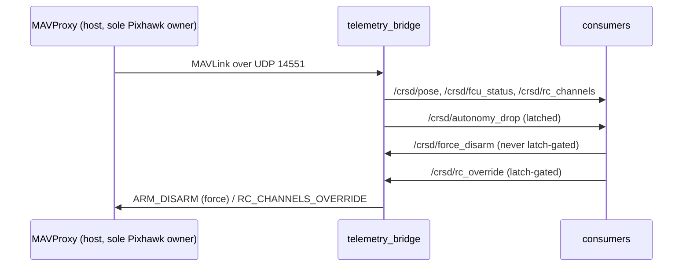

# `crusader_fcu` — the autopilot gateway

One node, `telemetry_bridge`, and it is the **only** thing in the workspace that speaks
MAVLink. In the architecture diagram it sits in two places at once: it is the
**Localization** source (pose out of the Pixhawk's EKF) *and* the **Movement** actuator
(force-disarm, RC override). That is why it is its own package rather than filed under
either domain.

## Topics

## Three rules enforced in code

**One Pixhawk owner.** The node raises at startup if `mav_endpoint` is not udp/tcp, so it
cannot be pointed at the serial device. MAVProxy owns that; everything else consumes the
rebroadcast.

**Silence stays silent.** Each RX stream is republished *only while fresh*. Replaying the
last cached frame with a new timestamp makes a dead MAVProxy indistinguishable from a
healthy one — which silently disables both of the watchdog's detection paths.

**Force-disarm is never latch-gated.** `_force_disarm_cb` must not consult
`latch.allowed`. Gating it would make an RC-loss kill impossible in exactly the situation
that produces one.

## Note on the RC-override path

Nothing in this repo currently publishes `/crsd/rc_override`. The path and its latch are
the Gate G1 mechanism, kept so the enforcement point exists — but the bench node that
drove them was removed in v0.5. G1 sign-off needs a replacement publisher first; see
`docs/G1_bench_procedure.md`.

## Change impact

| You changed | Then |
|---|---|
| anything in `telemetry_bridge.py` | restart the whole launch — every other node consumes it |
| the latch wiring | Gate G1 bench procedure, props off |
| the staleness/republish logic | re-verify the watchdog still detects a killed MAVProxy (`systemctl stop crsd-mavproxy` and watch) |
