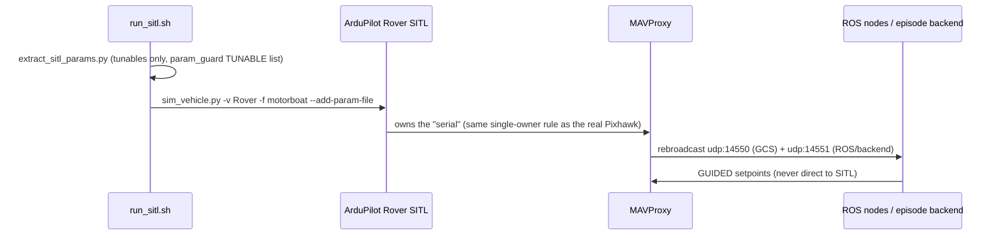

# `docker/` — SITL simulation environment

Currently holds the ArduPilot Rover **SITL** (software-in-the-loop) setup. The `crusader`
runtime container itself is the team's existing image (ROS 2 Humble + CUDA/TensorRT via
`ultralytics/ultralytics:latest-jetson-jetpack6` + MAVProxy + depthai) and is not rebuilt
from this repo.

**Design choice (plan §4.6):** SITL is the primary simulator because it runs the *same
ArduRover firmware code* as the boat — GUIDED turn-not-strafe behavior, `AVOID_*`, `WP_*`
logic and param effects are exact. Gazebo/VRX was cut (setup cost, low episode throughput);
the kinematic backend (`orchestrator/episodes/backends/kinematic.py`) covers millisecond
unit tests. Perception is injected synthetically — honest, since sim collision metrics are
flagged non-representative until model retraining (G2).

**Known limitation** (header of `run_sitl.sh`): the SITL "motorboat" frame does not model
OmniX lateral thrust. `dp_hold`-style RC-override mechanisms get logic-level testing only;
their dynamics are bench/field territory.

## Files

| File | Purpose |
|---|---|
| `sitl/install_sitl.sh` | Clone + build ArduPilot SITL inside the container (one-time) |
| `sitl/run_sitl.sh` | Launch Rover SITL with Crusader's *tunable* params extracted from `working_crusader_params.params` (hardware params stay SITL-default), MAVProxy attached in the same topology as the boat (rebroadcast on 14550/14551) |

## Sequence: SITL episode topology (identical to boat topology)

## Change-impact map

| If you edit… | Then |
|---|---|
| `run_sitl.sh` home location / params | orchestrator scenario origins must match (`HOME_LOC` ↔ scenario JSON origins) |
| SITL param extraction | re-check `tools/scripts/param_guard.py` TUNABLE list — they must agree |
| container base image (team-side) | regenerate the TensorRT engine (`buoy_v16.engine` is per-Jetson/JetPack) and re-run `setup/install_container.sh` |
