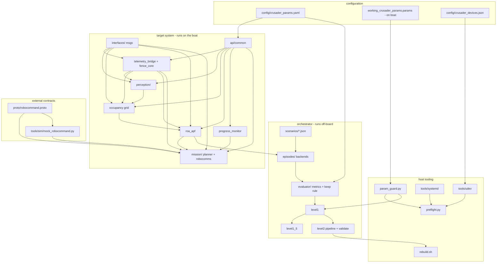

# Repo-wide change-impact map — "if I edit X, what does it affect and what must I re-run?"

Per-directory detail lives in each directory's README; this file is the whole-repo view.
Verification tiers: **U** = unit tests (seconds, any machine) · **S** = SITL/gate scripts
(minutes) · **B** = bench procedure (hardware) · **F** = field.

## Dependency graph (who feeds whom)

Reading the graph: an edit's blast radius is everything downstream of its node. The three
highest-fan-out nodes are `interfaces/` msgs, `api/common/`, and `crusader_params.yaml` —
treat edits there as repo-wide changes.

## Master impact table

| Edit target | Directly affects | Must re-run | Tier |
|---|---|---|---|
| `interfaces/*.msg` | every producer/consumer, recorded-bag readability | rebuild both pkgs, full pytest, G3+G4 | U+S |
| `rx26_asv/api/common/*` | all 16 entry points | full pytest, rebuild, one smoke episode | U+S |
| `config/crusader_params.yaml` (anchored values) | node behavior AND evaluator scoring | `tests/test_config_shared.py`, G3/G4 | U+S |
| `telemetry_bridge.py` / `fence_core.py` | pose for everyone; fence backstop; autonomy-drop | `test_fence_core.py`; G1 bench if safety path touched | U+B |
| `perception/*` | grid ingest → APF → objective-1 metrics | perception tests; G2 bench if detector/model | U+B |
| `perception/lidar_fusion.py` association gates | every fused RANGE → grid → APF. A gate that is too loose relocates a detection onto background clutter (looks confident, moves a real obstacle out of the avoidance horizon); too tight and fusion silently contributes nothing | `test_lidar_fusion.py` (the "association gates" section is the regression surface) + `test_config_shared.py`; bench-verify against a surveyed buoy with a shoreline behind it | U+B |
| `config/crusader_params.yaml` `range_gate_*` / `cluster_gap_m` | same as above — these ARE the gates, exposed as [DYN] | `test_config_shared.py`; re-check `/crsd/fusion_health` `never_agrees` after any change | U+B |
| `occupancy_core.py` / `apf_core.py` | avoidance behavior in **both** boat and orchestrator episodes (episodes run the real cores) | `test_occupancy_core/apf_core.py` + G3 | U+S |
| `progress_monitor.py` | objective-2 detection + scoring | `test_progress_monitor.py`, `test_config_shared.py` | U |
| `api/mission/*` | interrupt/resume, comms compliance | planner+robocomms tests + G4 | U+S |
| `api/safety/rc_heartbeat_core.py` / `_watchdog.py` | RC-loss force-disarm via `/crsd/force_disarm` | `test_rc_heartbeat_core.py`; G1 bench (RC-loss drill) | U+B |
| `api/perception/lidar_fusion*.py` | fused range on `/crsd/detections_fused` | `test_lidar_fusion.py`; bench (calibrated extrinsic) | U+B |
| `api/actuators/*` | Mission-3 launcher + water cannon | `test_actuator_core.py`; bench (real Maestro) | U+B |
| `api/ivc/*` | inter-vehicle relay (Missions 1/3), team-WiFi link | `test_ivc_link.py`; bench (two radios) | U+B |
| `proto/robocommand.proto` | robocomms + mock (must stay byte-identical) | recompile, loopback test, G4 | U+S |
| `orchestrator/evaluator/*` | every historical/future keep decision | `test_metrics.py`, `test_keep_rule.py`, G3+G4+G5 | U+S |
| `orchestrator/level2/validate.py` | the injected-code safety net | `test_level2.py`, G5 revert drills | U+S |
| `orchestrator/scenarios/*.json` | comparability of all results | add-don't-mutate; affected gates | S |
| `orchestrator/episodes/backends/gazebo.py` | every dp_hold / lateral-dynamics claim | `test_gazebo_backend.py`; container run vs `--backend sitl` | U+S |
| `orchestrator/evaluator/por_usv.py` | the 31 Aug PoR submission verdict | `test_por_usv.py`, `test_config_shared.py` | U |
| `config/crusader_params.yaml` `por_usv:` | PoR acceptance thresholds | `test_config_shared.py`; re-score any submitted run | U |
| `tools/sim/scenario_to_world.py` | physical course vs scored obstacles | `test_gazebo_backend.py` world/scenario tests | U |
| `tools/sim/models/crusader_omnix/model.sdf` | all gazebo-backend dynamics | `test_fit_hydro.py`; re-run gazebo episodes (not comparable across a refit) | U+S |
| `tools/sim/fit_hydro.py` | the coefficients above | `test_fit_hydro.py` | U |
| `tools/scripts/param_guard.py` | what autoresearch/preflight allow | pytest + safety review vs CLAUDE.md | U |
| `tools/udev/*`, `config/crusader_devices.json` | device names on the boat | `test_gen_udev.py`, reinstall + replug, preflight | U+B |
| `tools/systemd/*` | boot order (MAVProxy-first is safety) | reinstall on Jetson, reboot test | B |
| `docker/sitl/*` | SITL fidelity, scenario origins | one SITL episode in-container | S |
| `setup.py` entry points / `package.xml` | node launchability | CI colcon job, `ros2 pkg executables` in-container | U+S |
| `setup/*` scripts | fresh-machine bootstrap | run the script on its target machine; keep deps synced with `ci.yml` | U |
| `.github/workflows/ci.yml` | the gatekeeper itself | push to a branch, watch it go green | — |

## The three cross-cutting invariants (break one and many rows above go red)

1. **Single Pixhawk owner** — MAVProxy owns serial; `telemetry_bridge` is the only ROS
   consumer/override-sender. Any new MAVLink connection anywhere = automatic reject.
2. **Config anchors** — grid↔APF thresholds and monitor↔evaluator thresholds are YAML
   anchors; `tests/test_config_shared.py` fails the build on drift. Never copy a value
   out of the YAML into code.
3. **Same-path rule** — humans and autoresearch use identical paths (`rebuild.sh`,
   `param_guard.py`, the evaluator). If you add a manual shortcut, Level 2 inherits it.
