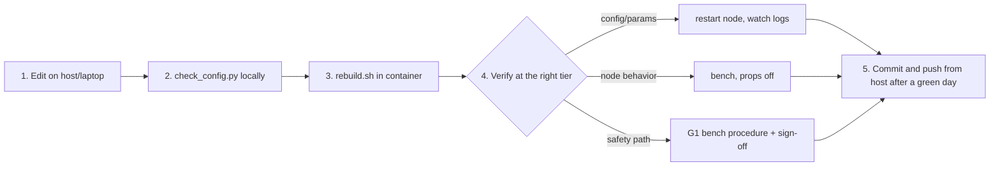

# RX26 Setup & Development Guide — read, run, update, in order

This is the sequential, modular walkthrough for the whole repo. Each part is self-contained:
do only the parts that match your machine and task. Terms are defined in the root
[README glossary](../README.md#glossary). For operating an already-installed boat, use
[OPERATIONS.md](OPERATIONS.md).

---

## Part A — READ (before touching anything)

| # | Read | Why first |
|---|---|---|
| A1 | Root [`README.md`](../README.md) | Structure, glossary, what this repo does and does not contain |
| A2 | The README of the directory you'll work in | Its design rationale + change-impact table |
| A3 | [`OPERATIONS.md`](OPERATIONS.md) | How the boat is actually run, and the current known gaps |

**The three rules you cannot learn the hard way:**

1. **One Pixhawk owner.** Only MAVProxy holds the serial device; only `telemetry_bridge`
   consumes the rebroadcast for ROS. Never open a second MAVLink/serial connection.
2. **Rebuild discipline.** In-container code is copied at build time. "The change did
   nothing" almost always means a skipped `tools/scripts/rebuild.sh`.
3. **Nothing ships until it has run on the boat.** A node that compiles and has never moved
   the vehicle does not go into `setup.py`'s entry points or `core.launch.py`. v0.5 deleted
   ~6,000 lines that were added the other way round.

---

## Part B — RUN (per machine role, in dependency order)

### B1. Dev machine (laptop — no ROS/hardware needed)

```bash
# Linux/macOS
bash setup/install_dev.sh
source .venv/bin/activate
```
```powershell
# Windows
powershell -ExecutionPolicy Bypass -File setup\install_dev.ps1
.\.venv\Scripts\Activate.ps1
```

The script self-verifies by running the config guards — which is also everything CI runs
off-boat:

```bash
python3 tools/scripts/check_config.py
```

There is no simulator and no test suite in this repo. Node behaviour is verified on the
bench and on the water, per [OPERATIONS.md](OPERATIONS.md) and the
[G1 bench procedure](G1_bench_procedure.md).

### B2. Jetson host (once per Jetson, and after cabling changes)

**Workspace layout.** `~/robotx_ws` is a colcon *workspace*, not this repo. Clone into
`src/`, alongside whatever else lives there:

```bash
mkdir -p ~/robotx_ws/src && cd ~/robotx_ws/src
git clone https://github.com/InspirationRobotics/rx26_asv.git
```

If the workspace holds package sources you are **not** building (e.g. the `robotx_2026`
boat repo kept for reference), mark them so colcon skips them entirely — otherwise
duplicate package names collide at build time and same-named executables become
ambiguous at `ros2 run` time. (Our packages are all `crusader_*` precisely to make an
accidental collision unlikely — but `robotx_2026` also ships a `led_node` executable.)

```bash
touch ~/robotx_ws/src/<other-repo>/COLCON_IGNORE
# check for overlaps first:
find ~/robotx_ws/src -name package.xml -exec grep -h "<name>" {} \; | sort | uniq -d
```

```bash
cd ~/robotx_ws/src/rx26_asv
sudo bash setup/install_jetson_host.sh    # udev → systemd → sanity checks
```

Boot chain after this: systemd starts MAVProxy (sole Pixhawk owner) → `asv` container.
LED tells you state at a glance: RED e-stopped · YELLOW armed/manual · GREEN autonomous.

### B3. Inside the container (once, and after package changes)

Seven packages build as one target: `crusader_bringup` depends on all of them, so
`--packages-up-to crusader_bringup` is the whole stack and stays correct as packages are
added. Every path that builds — `rebuild.sh`, `install_container.sh`, CI — uses that form.

```bash
docker exec -it asv bash /root/robotx_ws/src/rx26_asv/setup/install_container.sh
# dependency guard → colcon build (all seven packages) → import smoke
```

### B4. Boat bring-up (bench/field — day-of runbook)

1. Power on → LED RED → `python3 tools/scripts/preflight.py` **on the Jetson host**
   (not in the container) — **exit nonzero = do not arm**, and a SKIP is not a PASS.
2. GPS-yaw wait: open sky, 2–3 min (no heading? suspect `GPS1_COM_PORT` first).
3. ELRS e-stop range test (SB down = hardware kill; WiFi is never a safety tool).
4. `ros2 launch crusader_bringup core.launch.py`; flip the RC arm switch and confirm the LED and
   the launch logs change together.

**Standing safety constraint:** anything doing RC override is bench-only until the
autonomy-drop switch passes [Gate G1](G1_bench_procedure.md).

---

## Part C — UPDATE (the change workflow)



1. **Edit** outside the container (both see the same files via the mount).
2. **Check** config guards on your machine: `python3 tools/scripts/check_config.py`.
3. **Rebuild** if the change is in-container code: `tools/scripts/rebuild.sh` (never assume
   a hot edit is live).
4. **Verify at the right tier** — a param tweak needs a restart and a look at the logs; a
   change to the watchdog or the latch needs the bench, props off.
5. **Commit** with the evidence in the message. Pull on the Jetson **host**, never
   in-container. Push after a successful day.

### Common update recipes

| Task | Recipe |
|---|---|
| Change a parameter | Edit `config/crusader_params.yaml` + restart the node. No rebuild. Every param is `[RO]`, so `ros2 param set` will be rejected — that is deliberate. |
| Change an ArduRover param | Change it on the vehicle, verify it, then **re-export** `params/working_crusader.params` from QGC in the same commit. `param_guard.py` blocks protected params outright. |
| Add a ROS node | Pick the package by domain (see the root README table). Write `*_core.py` (pure logic) + `*_node.py` (wrapper via `crusader_common.node_main`), add a params section in the YAML and to `CONFIG_DRIVEN_NODES` in `check_config.py`. Add the `console_scripts` entry and the `core.launch.py` line **only after it has run on the boat**. |
| Add a message | `crusader_msgs/msg/` + its `CMakeLists.txt` line, then `rebuild.sh`, and update all producers/consumers in one commit. A `.msg` not listed in CMakeLists is silently not generated. |
| Add a package | `package.xml` + `setup.py` + `setup.cfg` + `resource/<name>`, then add it to `crusader_bringup/package.xml`'s exec_depends and to CI's discovery list — or it silently stops being built by every path. |
| Bring a mission node back | Define the topic contract with the sensor container first; port the algorithm from [robotx_2026](https://github.com/InspirationRobotics/robotx_2026) (prequal-proven), not from this repo's deleted rewrite. |

### Git / remote

```bash
bash setup/init_git_remote.sh                       # init + initial commit
bash setup/init_git_remote.sh <remote-url> --push   # wire origin + first push
```
