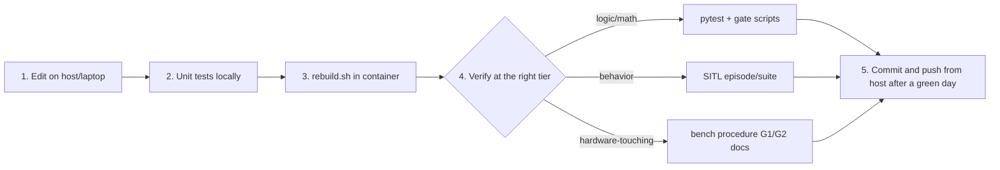

# RX26 Setup & Development Guide — read, run, update, in order

This is the sequential, modular walkthrough for the whole repo. Each part is self-contained:
do only the parts that match your machine and task. Terms are defined in the root
[README glossary](../README.md#glossary). The repo-wide "if I change X, what breaks?" map is
in [CHANGE_IMPACT_MAP.md](CHANGE_IMPACT_MAP.md).

---

## Part A — READ (before touching anything)

Read in this order; each step tells you why.

| # | Read | Why first |
|---|---|---|
| A1 | Root [`README.md`](../README.md) | Structure, glossary, per-directory design choices |
| A2 | [`README_PHASE0.md`](../README_PHASE0.md) | What each phase actually delivered, file by file, plus the Jetson merge procedure |
| A3 | The README of the directory you'll work in | Its sequence diagram + change-impact table |

**The two rules you cannot learn the hard way:**
1. **One Pixhawk owner.** Only MAVProxy holds the serial device; only `telemetry_bridge`
   consumes the rebroadcast for ROS. Never open a second MAVLink/serial connection.
2. **Rebuild discipline.** In-container code is copied at build time. "The change did
   nothing" almost always means a skipped `tools/scripts/rebuild.sh`.

---

## Part B — RUN (per machine role, in dependency order)

### B1. Dev machine (laptop — no ROS/hardware needed)

```bash
# Linux/macOS
bash setup/install_dev.sh
source .venv/bin/activate
```
```powershell
# Windows
powershell -ExecutionPolicy Bypass -File setup\install_dev.ps1
.\.venv\Scripts\Activate.ps1
```

The script self-verifies (full pytest + a Gate-G0 episode). You can now run everything
CI runs:

```bash
python -m pytest orchestrator/tests tests -q          # all unit tests
python orchestrator/run_episode.py \
    --scenario orchestrator/scenarios/mission1_transit.json \
    --backend kinematic --seed 0 --out ep.json        # one scripted episode
python orchestrator/run_gate_g3.py --seeds 20 --out g3.json   # APF gate
python orchestrator/run_gate_g4.py --seeds 10 --out g4.json   # Mission-4 gate
python orchestrator/run_gate_g5.py --episodes 50 --out g5.json # autoresearch gate
python orchestrator/run_autoresearch.py --proposer heuristic --iterations 5  # deterministic
tools/sim/mock_robocommand.py                          # RoboCommand event injector
```

LLM-driven autoresearch additionally needs `pip install anthropic` + `ANTHROPIC_API_KEY`:
`python orchestrator/run_autoresearch.py --proposer llm --iterations 20 --level2-every 4`.

### B2. Jetson host (once per Jetson, and after cabling changes)

**Workspace layout.** `~/robotx_ws` is a colcon *workspace*, not this repo. Clone into
`src/`, alongside whatever else lives there:

```bash
mkdir -p ~/robotx_ws/src && cd ~/robotx_ws/src
git clone https://github.com/InspirationRobotics/rx26_asv.git
```

If the workspace holds package sources you are **not** building (e.g. an older boat
repo kept for reference), mark them so colcon skips them entirely — otherwise
duplicate package names such as `interfaces` will collide at build time and
same-named executables become ambiguous at `ros2 run` time:

```bash
touch ~/robotx_ws/src/<other-repo>/COLCON_IGNORE
# check for overlaps first:
find ~/robotx_ws/src -name package.xml -exec grep -h "<name>" {} \; | sort | uniq -d
```

Per-Jetson TensorRT engines live at the **workspace** level (`~/robotx_ws/models/`), not
in the repo — they are gitignored and copied in out-of-band. See §B5 and
[G2_bench_procedure.md](G2_bench_procedure.md).

```bash
cd ~/robotx_ws/src/rx26_asv
sudo bash setup/install_jetson_host.sh    # udev → systemd → sanity checks
```

Boot chain after this: systemd starts MAVProxy (sole Pixhawk owner) → `crusader` container.
LED tells you state at a glance: RED e-stopped · YELLOW armed/manual · GREEN autonomous.

### B3. Inside the container (once, and after proto/package changes)

```bash
docker exec -it crusader bash /root/robotx_ws/src/rx26_asv/setup/install_container.sh
# pip top-ups → protoc → colcon build (rx26_asv + interfaces) → import smoke
```

### B4. SITL simulation (in-container, for scenario-level testing)

```bash
docker exec -it crusader bash /root/robotx_ws/src/rx26_asv/docker/sitl/install_sitl.sh  # one-time
docker exec -it crusader bash /root/robotx_ws/src/rx26_asv/docker/sitl/run_sitl.sh      # launch
# then, SITL-backend episodes:
RX26_SITL_OK=1 python3 orchestrator/run_episode.py \
    --scenario orchestrator/scenarios/mission1_transit.json \
    --backend sitl --mav udp:127.0.0.1:14550 --out /tmp/ep.json
```

### B5. Boat bring-up (bench/field — day-of runbook, plan §7)

1. Power on → LED RED → `docker exec -it crusader python3 /root/robotx_ws/src/rx26_asv/tools/scripts/preflight.py`
   — **exit nonzero = do not arm.**
2. GPS-yaw wait: open sky, 2–3 min (no heading? suspect `GPS1_COM_PORT` first).
3. ELRS e-stop range test (SB down = hardware kill; WiFi is never a safety tool).
4. Arm → mission select → go. Between runs: pull metrics JSON + bag; triage from logs only.

**Standing safety constraint:** anything doing RC override (`dp_hold`-style, any Level-2
mechanism like it) is sim/bench-only until the autonomy-drop switch passes Gate G1.

---

## Part C — UPDATE (the change workflow, systematic)

Every change follows the same five steps; only the verification level differs.



1. **Edit** outside the container (both see the same files via the mount). Find your file's
   blast radius in [CHANGE_IMPACT_MAP.md](CHANGE_IMPACT_MAP.md) *before* editing.
2. **Unit-test** on your machine: `python -m pytest tests orchestrator/tests -q`.
3. **Rebuild** if the change is in-container code: `tools/scripts/rebuild.sh` (never assume a
   hot edit is live).
4. **Verify at the tier the impact map names** — a param tweak needs a restart + the shared
   config test; an `apf_core` edit needs G3; a planner edit needs G4; a `.msg` edit needs
   everything.
5. **Commit** with the test evidence in the message. Pull on the Jetson **host**, never
   in-container. Push after a successful day.

### Common update recipes

| Task | Recipe |
|---|---|
| Tune a `[DYN]` parameter | `ros2 param set /<node> <param> <value>` live, or edit `config/crusader_params.yaml` + restart. No rebuild. |
| Change a `[RO]`/safety parameter | Edit YAML + restart + review vs CLAUDE.md. `param_guard.py` will block protected ArduRover params. |
| Add a ROS node | Write `*_core.py` (pure logic) + `*_node.py` (wrapper via `api/common/node_main`), add a `console_scripts` entry in `setup.py`, params section in the YAML, tests, rebuild, add to launch + `preflight.py` topic list. |
| Add a message | `interfaces/msg/` + `CMakeLists.txt`, rebuild both packages, update all producers/consumers in one commit. |
| Change RoboCommand schema | `proto/robocommand.proto` + `robocomms.py` + `mock_robocommand.py` in one commit; loopback test + G4. |
| Add a scenario | New JSON in `orchestrator/scenarios/` (never mutate an existing one — versioned comparability). |
| Retrain the buoy model | `tools/training/prep_dataset.py` → `train_buoy.py` → `eval_regression.py` (nonzero exit = no deploy) → regenerate per-Jetson engine → G2 bench sign-off. |
| Run autoresearch for real | SITL up (B4), then `run_autoresearch.py --proposer llm`. The keep-rule and `param_guard` enforce what it may touch; revert is automatic on any validate stage failure. |

### Git / remote

```bash
bash setup/init_git_remote.sh                       # init + initial commit
bash setup/init_git_remote.sh <remote-url> --push   # wire origin + first push
```

If this checkout is meant to **merge into the live Jetson repo** instead of standing alone,
follow the `rsync --ignore-existing` procedure in `README_PHASE0.md` and reconcile
`setup.py` entry points by hand — do not push over the live history.
