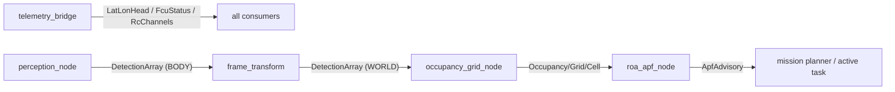

# `interfaces/` — ROS 2 message definitions (ament_cmake / rosidl)

Typed contracts between nodes. Message *shapes* are ported from the proven RX24 stack 
so legacy-tested semantics carry over; the package builds with
`ament_cmake` + `rosidl` (messages can't be ament_python).

**Design choice:** intra-boat comms are ROS 2 topics, not the legacy `comms_core` sockets
 — typed messages caught interface drift at `colcon build` in CI instead of on the
water. The RoboCommand link is the one exception: protobuf at the edge (`../proto/`),
converted to these types at the boundary by `robocomms.py`.

## Messages

| Message | Producer → Consumer | Notes |
|---|---|---|
| `Occupancy`, `Grid`, `Cell` | `occupancy_grid_node` → `roa_apf_node` | RX24 shape retained: origin, position+heading, cell_size, ranges, sparse `cells[]` |
| `LatLonHead` | `telemetry_bridge` → everyone | fused ArduRover pose (EK3, GPS moving-baseline yaw) |
| `FcuStatus` | `telemetry_bridge` → planner, LED | mode/armed/health |
| `RcChannels` | `telemetry_bridge` → `drop_latch` consumers | autonomy-drop switch channel lives here |
| `Detection`, `DetectionArray` | `perception_node` → `frame_transform` → grid | BODY frame at source; WORLD after transform |
| `ApfAdvisory` | `roa_apf_node` → active task | corrected goal + speed scale — advisory only, never a motor command |

## Message flow

## Change-impact map

Editing a `.msg` file is the **highest-blast-radius change in the repo**: every
producer/consumer pair must be rebuilt together, and the orchestrator's evaluator may read
the same fields from bags.

| If you edit… | Then |
|---|---|
| any `.msg` | rebuild BOTH packages in-container (`tools/scripts/rebuild.sh`), fix all producers/consumers in the same commit, re-run full pytest + G3/G4 |
| add a `.msg` | add to `CMakeLists.txt` `rosidl_generate_interfaces`, then as above |
| `package.xml` / `CMakeLists.txt` | CI `interfaces` job is the canary (`colcon build` on ros:humble) |

Never rename/renumber fields casually — recorded bags from earlier episodes become
unreadable, which breaks the Level-2 Explore round's trace reading.
