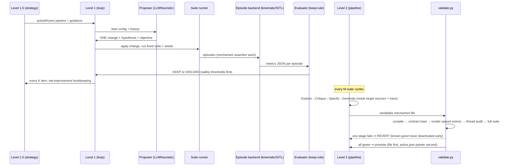

# `orchestrator/` — the autoresearch harness (Levels 1 / 1.5 / 2)

This is the **orchestrator**, not the boat: a plain-Python-`threading` harness that proposes
changes to the target system (`../robotx_2026/` + ArduRover tunables), runs episodes, scores
them against the three objectives, and keeps or reverts. It is `COLCON_IGNORE`d — it never
becomes a ROS node, never imports `rclpy`, and never opens a Pixhawk connection.

**Design choices (why it looks like this):**
- **In-repo but build-ignored** (plan §3.5): one atomic git history covers a Level-2 mechanism
  injection *and* the harness state that produced it, so validate-and-revert is one `git revert`.
- **Keep-rule lives in the evaluator, never the proposer** — the LLM can argue for a change;
  only measured episodes across the fixed suite can keep it.
- **`ScriptedLLM` twin for every LLM path** — CI and the G5 gate run deterministically with no
  API key; `AnthropicLLM` is a drop-in for real runs.

## Module map

| Module | Role |
|---|---|
| `episodes/` | Scenario loading (`scenario.py`), episode runner, backends: `kinematic` (ms-fast unit-level sim) and `sitl` (ArduPilot Rover SITL — same firmware as the boat, plan §4.6), `apf_advisor` (runs the boat's real `apf_core` in-loop) |
| `evaluator/` | `metrics.py` (3-objective episode JSON, schema `rx26-episode-metrics/1`), `keep_rule.py` (no-regression-past-safety-thresholds enforcement) |
| `level1/` | Parameter loop: `param_space` (bounded tunables, PROTECTED params rejected pre-evaluation via `param_guard`), `proposers` (heuristic + LLM), `suite` (fixed-suite runner + active-mechanism assertion + thread audit), `loop` (JSONL history) |
| `level1_5/` | Search-strategy loop: freeze stalled params, unfreeze on failure-mode change, objective-pointed guidance. **Only** changes which params get attention. |
| `level2/` | Mechanism research: `contract` (mechanism interface + `active.json` registry), `pipeline` (Explore→Critique→Specify→Generate), `validate` (staged validate-and-revert), `fixtures/` (deliberately broken mechanisms proving each stage catches its failure), `mechanisms/` (known-good `baseline_apf` + promoted candidates) |
| `scenarios/` | The fixed evaluation suite (Mission 1 transit/obstacle-field, Mission 4 Core/Advanced) — versioned JSON, never cherry-picked |
| `run_episode.py` | Gate G0 entry: one scripted episode → metrics JSON |
| `run_gate_g3/g4/g5.py` | CI gates (see root README glossary) |
| `run_autoresearch.py` | The real entry point: `--proposer llm --level2-every M` |
| `llm.py` | `AnthropicLLM` / `ScriptedLLM` |

## Sequence: one autoresearch iteration (with a Level-2 round)

## Change-impact map

| If you edit… | Re-run first | Downstream effect |
|---|---|---|
| `evaluator/metrics.py` | `tests/test_metrics.py` + **all** gate scripts | every KEEP/DISCARD decision ever made; schema consumers (CI smoke) |
| `evaluator/keep_rule.py` | `test_keep_rule.py`, G5 | what gets promoted — safety-critical review required |
| `episodes/backends/*` | `test_kinematic_episode.py` / SITL leg in container | all episode fidelity; G0 |
| `level1/param_space.py` | `test_level1.py` | which ArduRover params autoresearch may touch — cross-check `tools/scripts/param_guard.py` PROTECTED list |
| `level2/validate.py` | `test_level2.py` + G5 revert drills | the safety net for injected code — never weaken a stage |
| `scenarios/*.json` | G3/G4 gates | comparability of ALL historical results — version, don't mutate |
| `../robotx_2026/api/navigation/apf_core.py` (target code) | G3 here | the suite runs the boat's real code — target edits show up as episode deltas |

**Failure modes actively guarded (CLAUDE.md):** silent fallback on injection failure, orphaned
threads (Event-based teardown audited per episode), second Pixhawk consumer (auto-reject),
blended-score gaming, single-episode "wins" (full suite × seeds before promotion).
