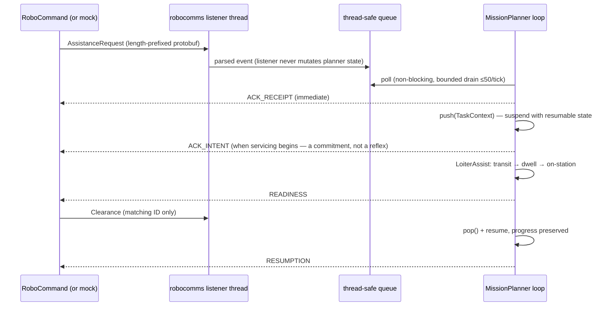

# `proto/` — RoboCommand wire schema

`robocommand.proto` defines every message on the competition's RJ-45 RoboCommand link:
assistance requests, static keep-outs, moving virtual obstacles, All Clear, and the boat's
acknowledgment/status messages.

**Design choice (plan §4.5): protobuf at the edge, ROS inside.** Only
`robotx_2026/api/mission/robocomms.py` imports the generated classes; everything else sees
internal events/ROS messages. This keeps the mandated wire format isolated, and lets
`tools/sim/mock_robocommand.py` exercise **byte-identical framing** before the real link
exists. Until `protoc` runs, `robocomms.py` uses a JSON fallback with the same
length-prefixed framing (proven identical in the loopback integration test).

Compile (inside the container — `setup/install_container.sh` does this):

```bash
protoc -I proto --python_out=robotx_2026/api/mission proto/robocommand.proto
```

Generated `*_pb2.py` files are `.gitignore`d — always regenerated, never committed.

## Sequence: Mission-4 Core interrupt over this link



## Change-impact map

| If you edit `robocommand.proto`… | Then |
|---|---|
| any field | recompile in-container, update `robocomms.py` boundary conversion, re-run `tests/test_robocomms_integration.py` (byte-identical loopback) and Gate G4 |
| framing (length prefix) | also update `tools/sim/mock_robocommand.py` in the same commit — the mock must stay byte-identical or Mission-4 test fidelity is gone |

A missed or malformed ack is a **scoring failure independent of the maneuver** — comms
compliance is its own objective-3 sub-metric.
