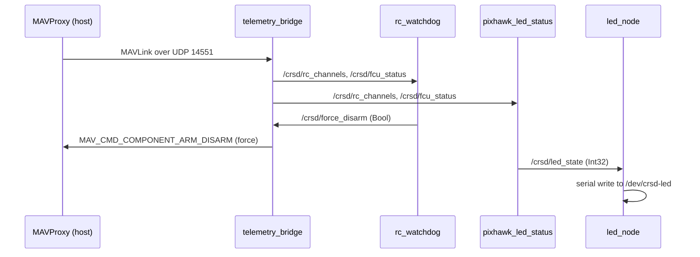

# `rx26_asv` — the ROS 2 nodes

The importable Python module. Everything here runs inside the `asv` container on the
Jetson.

**Core design choice:** ArduRover owns actuation and estimation. Our nodes observe and
advise; exactly one of them talks MAVLink. That buys EK3, the failsafes and the e-stop path
for free, and means there is no PWM mixer or parallel EKF to maintain.

## Nodes

| Module | What it does | Status |
|---|---|---|
| `api/navigation/telemetry_bridge.py` | The single ROS-side gateway to MAVProxy's rebroadcast. RX: republishes `/crsd/pose`, `/crsd/fcu_status`, `/crsd/rc_channels`, latched `/crsd/autonomy_drop`. TX: force-disarm (never latch-gated) and RC overrides (latch-gated) | field |
| `api/safety/rc_heartbeat_watchdog.py` (+`rc_heartbeat_core`) | Force-disarm when the RC transmitter link dies, without anyone pressing the SB switch. Complements — never replaces — ArduPilot's FS_THR/FS_GCS and the hardware e-stop | field |
| `api/pixhawk/pixhawk_led_status_node.py` | Autopilot + RC state → `/crsd/led_state` (1 RED / 2 YELLOW / 3 GREEN) | field |
| `api/led/led_node.py` | `/crsd/led_state` → LED Arduino over serial, with auto-reconnect (EMI knocks the CH340 off the bus and it re-enumerates) | field |

Shared plumbing in `api/common/`: `config` (params file loader), `param_utils`
(`declare_from_config` + range validation), `node_main` (`run_node` lifecycle with
deterministic teardown), `stream_cache` (freshness-gated value cache), `drop_latch`
(the autonomy-drop state machine), `geo` (lat/lon ↔ local XY, ground speed).

## Data flow

## Two rules that are enforced in code, not just documented

**One Pixhawk owner.** `telemetry_bridge` raises at startup if `mav_endpoint` is not
udp/tcp. No other node may open a MAVLink connection at all — the nodes that used to
(`pixhawk_led_status_node`, the watchdog) were rewired to consume republished topics
precisely so a second consumer cannot race the graph.

**Silence stays silent.** Each RX stream is republished only while fresh. Replaying the
last cached frame with a new timestamp makes a dead MAVProxy indistinguishable from a
healthy one, which silently disables both of the watchdog's detection paths.

## Change impact

| You changed | Verify by |
|---|---|
| `rc_heartbeat_core.py` | bench, props off: pull the transmitter, confirm the boat disarms |
| `telemetry_bridge.py` | restart the whole launch — every node downstream consumes it |
| `drop_latch.py` | the Gate G1 procedure (`docs/G1_bench_procedure.md`) |
| `led_node.py` / `LED.ino` | `ros2 topic pub /crsd/led_state std_msgs/msg/Int32 "{data: 2}" --once` |
| `config/crusader_params.yaml` | `python3 tools/scripts/check_config.py`, then restart the node |

## Adding a node

New nodes join `core.launch.py` and `setup.py`'s entry points **after** they have run on
the boat, not when they compile. The v0.5 strip removed eleven nodes that had never moved
the vehicle; the entry-point list is the shipped stack, and it is meant to stay honest.
