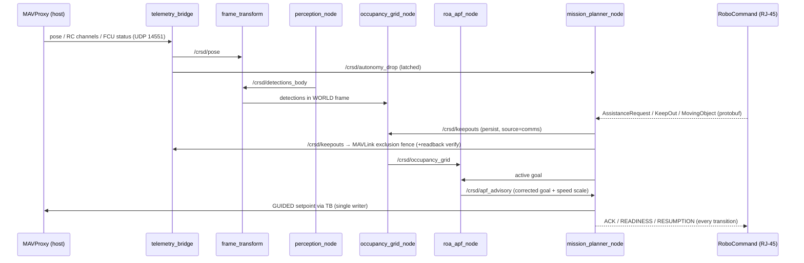

# `rx26_asv/` — the ROS 2 package (Crusader's onboard nodes)

This directory is the **target system**: the code that actually runs on the boat, inside the
`asv` container. The autoresearch harness (`../orchestrator/`) reads and edits this code
from the outside but is never imported by it.

**Design rule:** ArduRover on the Pixhawk owns
actuation and state estimation. **No node here ever produces PWM, opens a serial link to the
Pixhawk, or runs its own EKF.** Everything reads/writes through MAVProxy's UDP rebroadcast,
and exactly one node (`telemetry_bridge`) touches that link. 

## Module map

| Module | Role | Phase |
|---|---|---|
| `api/common/` | Shared plumbing: `drop_latch` (autonomy-drop state machine), `override_guard` (client pattern for RC-override producers), `geo`, `config`+`param_utils` (params from `config/crusader_params.yaml`, `[RO]`/`[DYN]` postures), `node_main` (canonical safe startup/teardown for all entry points) | 1, 3.5 |
| `api/navigation/telemetry_bridge.py` | **THE single MAVProxy consumer and THE single RC-override / GUIDED / force-disarm sender.** Publishes `/crsd/pose`, `/crsd/fcu_status`, `/crsd/rc_channels`, latched `/crsd/autonomy_drop`; forwards `/crsd/force_disarm` (latch-independent) for the safety watchdog; uploads keep-out fences with mandatory readback (`fence_core`) | 1, 3 |
| `api/navigation/frame_transform.py` | BODY→WORLD detection transform + latched `/crsd/world_origin` | 1 |
| `api/perception/` | `perception_node` (capture→detect→associate → `/crsd/detections_body`), `detector` (TensorRT + class map), `depth_association`, `oakd_guard` (USB3 SUPER assert), `pipeline_stats` (fps/latency health) | 2 |
| `api/perception/lidar_fusion_node.py` (+`lidar_fusion`) | Livox MID360 ↔ camera detection fusion: refines each detection's **range** from LiDAR returns in its bearing sector; a detection with no LiDAR support is passed through with its camera range, never dropped (objective-1 invariant) → `/crsd/detections_fused` | ops |
| `api/navigation/occupancy_grid_node.py` (+`occupancy_core`) | World-frame sparse grid; perception cells decay, comms keep-out cells persist until All Clear and can never be overwritten by perception | 3 |
| `api/navigation/roa_apf_node.py` (+`apf_core`) | APF **advisory** — corrected goal + speed scale on `/crsd/apf_advisory`; never commands motors (plan §3.2 single-writer arbitration) | 3 |
| `api/navigation/progress_monitor.py` | Preventative local-minima detector — flags "at risk" *before* a stall (objective 2) | 3 |
| `api/mission/` | `mission_planner_node` + `planner` (task stack, interrupt/resume), `task_stack` (`TaskContext` resumable state), `tasks/` (WaypointMission, LoiterAssist), `robocomms` (RoboCommand listener thread → queue), `events` | 4 |
| `api/safety/rc_heartbeat_watchdog.py` (+`rc_heartbeat_core`) | Force-disarm on RC-transmitter link loss. Consumes `telemetry_bridge` topics (`/crsd/rc_channels`, `/crsd/fcu_status`), routes the disarm back via `/crsd/force_disarm` — no own MAVLink conn. All latch/link-loss logic is in the ROS-free `rc_heartbeat_core`. Complements ArduPilot FS_THR/FS_GCS + the hardware SB e-stop (defense in depth) | ops |
| `api/actuators/actuator_node.py` (+`actuator_core`) | Mission-3 effectors on one Maestro serial link: delivery launcher (`/crsd/actuator/launch`,`/release`) + water cannon (`/crsd/actuator/pump`). ROS services, not motors. Wire-protocol encoding in the ROS-free `actuator_core` | ops |
| `api/ivc/ivc_node.py` (+`ivc_link`) | Inter-vehicle comms over the **team WiFi** (Bullet AC) — String ⇄ peer via a background connection thread (`/crsd/ivc/send`,`/receive`,`/health`). Separate from the RJ-45 RoboCommand link and the Pixhawk link. ROS-free `ivc_link` core | ops |
| `api/testing/rc_override_smoke.py` | G1 bench node (props off) — never launched outside the G1 procedure | 1 |

## Runtime sequence (one control cycle, all phases live)

Key reading of this diagram: **the APF never talks to the Pixhawk.** It advises; the active
task blends the advisory into its setpoint. Keep-outs take **two** paths on purpose — the
fence upload is the hard ArduRover-enforced backstop, the grid/APF path is the smooth
avoidance. If the ROS layer dies, the fence still holds.

## Change-impact map (edit → what to re-run / what it affects)

| If you edit… | Rebuild? | Re-run first | Downstream effect |
|---|---|---|---|
| `api/common/*` | yes (`tools/scripts/rebuild.sh`) | `pytest tests/` | **every node** — all entry points route through `node_main`/`config` |
| `telemetry_bridge.py` / `fence_core.py` | yes | `tests/test_fence_core.py`, G1 bench | pose for all consumers; fence backstop; autonomy-drop safety path; `/crsd/force_disarm` (RC-loss failsafe) |
| `api/safety/rc_heartbeat_core.py` / `rc_heartbeat_watchdog.py` | yes | `tests/test_rc_heartbeat_core.py` + G1 bench (RC-loss drill) | RC-transmitter-loss force-disarm; depends on telemetry_bridge topics + `/crsd/force_disarm` |
| `perception/*` | yes | `tests/test_depth_association.py`, `test_pipeline_stats.py`; G2 gate if detector/model touched | occupancy ingest → APF → objective-1 metrics |
| `perception/lidar_fusion*.py` | yes | `tests/test_lidar_fusion.py` | fused range on `/crsd/detections_fused`; extrinsic/NIC prerequisites (CLAUDE.md) |
| `api/actuators/*` | yes | `tests/test_actuator_core.py` + bench (real controller) | Mission-3 launcher/pump; Maestro wire protocol |
| `api/ivc/*` | yes | `tests/test_ivc_link.py` + bench (two radios) | inter-vehicle relay (Missions 1/3); team-WiFi link only |
| `occupancy_core.py` | yes | `tests/test_occupancy_core.py` + `orchestrator/run_gate_g3.py` | APF inputs, keep-out persistence (Mission 4) |
| `apf_core.py` | yes | `tests/test_apf_core.py` + **G3** (20 seeds) | avoidance behavior; equilibrium-distance-vs-AVOID_MARGIN assert must stay green |
| `progress_monitor.py` | yes | `tests/test_progress_monitor.py` + `tests/test_config_shared.py` | objective-2 scoring — evaluator thresholds are anchored to the same YAML |
| `mission/*` | yes | `tests/test_planner.py`, `test_robocomms_integration.py` + **G4** | interrupt/resume, comms compliance scoring |
| Any node's params | no rebuild — edit `config/crusader_params.yaml`, restart node | `tests/test_config_shared.py` | `[DYN]` params also settable live via `ros2 param set` |

## Jetson wiring (after merge into the live repo)

Entry points are declared in the root [`setup.py`](../setup.py). After merge: add
`telemetry_bridge` + `frame_transform` + `perception_node` + `occupancy_grid_node` +
`roa_apf_node` + `mission_planner_node` to `core.launch.py`, in that order. MAVProxy needs
`--out udp:127.0.0.1:14551` (check `scripts/start_mavproxy.sh`). Do **not** launch
`rc_override_smoke` outside the G1 bench procedure.
