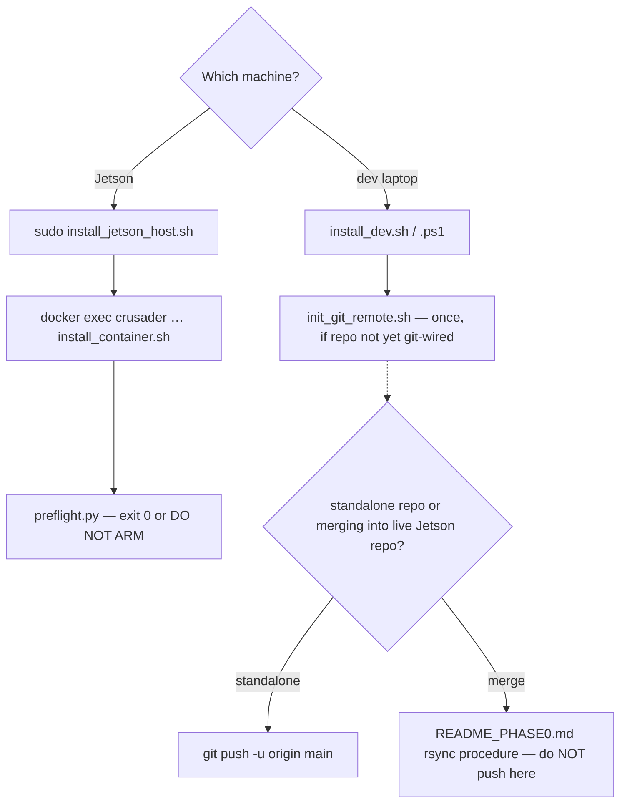

# `setup/` — installation & bootstrap scripts

One script per machine role, runnable independently (modular) but designed to be read in
this order. Each script is idempotent where feasible and verifies its own work.

| Script | Where it runs | What it does |
|---|---|---|
| `install_dev.sh` / `install_dev.ps1` | dev laptop (Linux/macOS / Windows) | venv + orchestrator/test deps, then proves the install by running the full pytest suite and a Gate-G0 kinematic episode |
| `install_jetson_host.sh` | Jetson **host** (sudo, outside container) | udev rules → systemd units (MAVProxy-first boot chain) → sanity checks |
| `install_container.sh` | inside the `crusader` container | pip top-ups → protobuf compile → `colcon build` (both packages) → import smoke |
| `init_git_remote.sh` | anywhere | idempotent `git init -b main` + initial commit + optional `origin` remote/push |

## Which script, in what order?

## Change-impact map

| If you edit… | Keep in sync |
|---|---|
| dev deps in `install_dev.*` | `.github/workflows/ci.yml` pip line — CI and dev must install the same set |
| container deps in `install_container.sh` | the team's container image docs; `tools/scripts/rebuild.sh` assumes the build here succeeded once |
| systemd install steps | `tools/systemd/*.service` unit files themselves |

Full sequential walkthrough: [`docs/SETUP_GUIDE.md`](../docs/SETUP_GUIDE.md).
