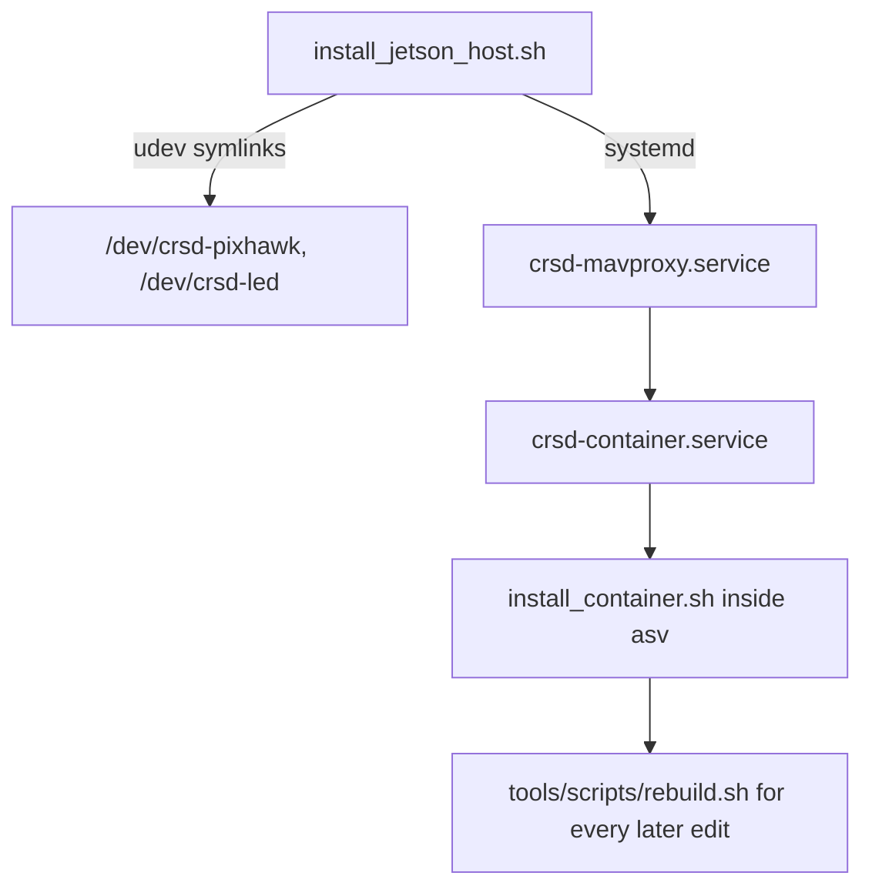

# `setup/` — one idempotent script per machine role

Fresh-machine bootstrap must not depend on tribal knowledge. Each script is safe to
re-run, verifies its own work, and fails loudly rather than half-installing.

| Script | Machine | What it does |
|---|---|---|
| `install_dev.sh` / `install_dev.ps1` | dev laptop (Linux/macOS / Windows) | venv + pyyaml, then proves the install by running the config guards |
| `install_jetson_host.sh` | Jetson host (sudo) | udev rules → systemd units (MAVProxy + container, ordered) → verification |
| `install_container.sh` | inside the `asv` container | dependency guard → colcon build → import smoke |
| `init_git_remote.sh` | any standalone clone with no git yet | idempotent `git init` + remote wiring |
| `install_robocommand_sim.sh` | the simulated RoboNation server (Linux, sudo) | static `192.168.65.2` + DHCP on one NIC → RoboNation's docker stub → isolation check |

## Order, on a boat being set up from scratch

The host script must run before the container one: the container's nodes need the udev
symlinks to exist, and MAVProxy must own the Pixhawk before anything else starts.

## The sim box is off the boat's critical path

`install_robocommand_sim.sh` builds the bench's third machine and touches nothing the
boat depends on. It is deliberately paranoid about two things, both of which cost you
the machine or the gate if they go wrong:

- **It refuses the interface carrying your default route.** Reconfiguring the NIC your
  SSH session runs over ends the session, and on a headless box ends your access.
- **`--check` fails if any second network is up.** Docker sets `ip_forward=1` for you,
  so a sim box that is also on the team wifi is a router between the course subnet and
  the boat — exactly the topology the handbook prohibits. Pull the images while you
  have internet, then take the wifi down.

**Status: syntax-checked, never run on a real Linux box.** The apt, nmcli, netplan and
dnsmasq paths are unexercised. Read it before you run it.

## Runtime dependencies live in the image, not in these scripts

`install_container.sh` **installs nothing**. It checks that the image already provides
what the stack needs and fails if not. An unpinned `pip install` from a running container
is undocumented state that vanishes on `docker rm` — and one of them once resolved a
dependency out from under the rest of the stack on the real Jetson. Change the Dockerfile
and rebuild the image instead.

## Change impact

| You changed | Re-run |
|---|---|
| `Dockerfile` | `docker build -t asv .` on the Jetson, then `install_container.sh` |
| `tools/udev/*` or `tools/systemd/*` | `sudo bash setup/install_jetson_host.sh` |
| any `setup/*.sh` | CI syntax-checks every tracked shell script and its executable bit |
