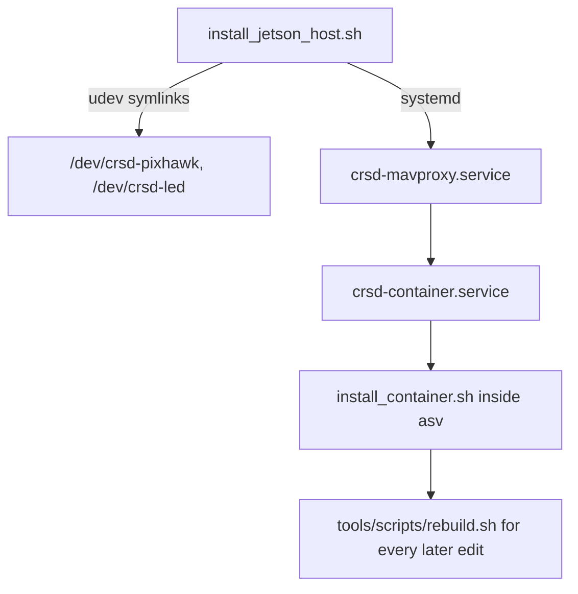

# `setup/` — one idempotent script per machine role

Fresh-machine bootstrap must not depend on tribal knowledge. Each script is safe to
re-run, verifies its own work, and fails loudly rather than half-installing.

| Script | Machine | What it does |
|---|---|---|
| `install_dev.sh` / `install_dev.ps1` | dev laptop (Linux/macOS / Windows) | venv + pyyaml, then proves the install by running the config guards |
| `install_jetson_host.sh` | Jetson host (sudo) | udev rules → systemd units (MAVProxy + container, ordered) → verification |
| `install_container.sh` | inside the `asv` container | dependency guard → colcon build → import smoke |
| `init_git_remote.sh` | any standalone clone with no git yet | idempotent `git init` + remote wiring |
| `install_robocommand_sim.sh` | the simulated RoboNation server (Linux, sudo) | static `192.168.65.2` + DHCP on one NIC → RoboNation's docker stub → isolation check |
| `asv_add_bt.Dockerfile`, `asv_add_nav2.Dockerfile` | Jetson host (`docker build`) | one layer each on top of the image the boat RUNS: BehaviorTree.CPP, then Nav2 + STVL. Not a rebuild of `../Dockerfile`: see "Recreating the asv container" |

## Order, on a boat being set up from scratch


```mermaid
flowchart TD
    H[install_jetson_host.sh] -->|udev symlinks| D["/dev/crsd-pixhawk, /dev/crsd-led"]
    H -->|systemd| M[crsd-mavproxy.service]
    M --> C[crsd-container.service]
    C --> I[install_container.sh inside asv]
    I --> R[tools/scripts/rebuild.sh for every later edit]
```

The host script must run before the container one: the container's nodes need the udev
symlinks to exist, and MAVProxy must own the Pixhawk before anything else starts.

## The sim box is off the boat's critical path

`install_robocommand_sim.sh` builds the bench's third machine and touches nothing the
boat depends on. It is deliberately paranoid about two things, both of which cost you
the machine or the gate if they go wrong:

- **It refuses the interface carrying your default route.** Reconfiguring the NIC your
  SSH session runs over ends the session, and on a headless box ends your access.
- **`--check` fails if any second network is up.** Docker sets `ip_forward=1` for you,
  so a sim box that is also on the team wifi is a router between the course subnet and
  the boat — exactly the topology the handbook prohibits. Pull the images while you
  have internet, then take the wifi down.

**Status: syntax-checked, never run on a real Linux box.** The apt, nmcli, netplan and
dnsmasq paths are unexercised. Read it before you run it.

## Runtime dependencies live in the image, not in these scripts

`install_container.sh` **installs nothing**. It checks that the image already provides
what the stack needs and fails if not. An unpinned `pip install` from a running container
is undocumented state that vanishes on `docker rm` — and one of them once resolved a
dependency out from under the rest of the stack on the real Jetson. Change the Dockerfile
and rebuild the image instead.

## Recreating the asv container

The boat's `asv` container runs an image that is not a build of `../Dockerfile` (its history
has hand-made steps that file no longer has), so a new package set goes in as **one layer on
top of the image the boat runs**, and the container is then recreated from that image with the
SAME flags. `asv_add_bt.Dockerfile` (BehaviorTree.CPP) and `asv_add_nav2.Dockerfile` (Nav2
planner and costmap, STVL, and BehaviorTree.CPP again, idempotently) are those layers. The
Nav2 one is for `docs/nav2_avoidance_spec.md`; it is **written and parsed, but never built
against the boat's real image**. The sanity build was against the x86 sim image only.

**This needs explicit team approval.** Run it on the **Jetson host** over
`ssh crusader@192.168.100.109`, in bash, with the boat on the stand and **disarmed**. `sudo`
needs Chris's password: ask him, do not type it for him. Anything that lives only inside the old
container is kept by renaming it, not removing it.

Step 0, record the truth. The flags the live container was created with are not written down
anywhere else:

```bash
docker inspect asv --format '{{.Config.Image}}'
docker inspect asv > ~/asv_pre_nav2.inspect.json
docker inspect asv --format 'binds={{json .HostConfig.Binds}} priv={{.HostConfig.Privileged}} net={{.HostConfig.NetworkMode}} runtime={{.HostConfig.Runtime}} restart={{json .HostConfig.RestartPolicy}} tty={{.Config.Tty}} stdin={{.Config.OpenStdin}} cmd={{json .Config.Cmd}}'
```

Step 1, build the layer to a NEW tag. The running container is untouched:

```bash
cd ~/robotx_ws/src/rx26_asv/setup && docker build -f asv_add_nav2.Dockerfile --build-arg BASE="$(docker inspect asv --format '{{.Config.Image}}')" -t asv:nav2-YYYYMMDD .
```

Step 2, smoke-test the image in a throwaway container:

```bash
docker run --rm --network host asv:nav2-YYYYMMDD bash -lc 'source /opt/ros/humble/setup.bash && ros2 pkg prefix nav2_planner && ros2 pkg prefix spatio_temporal_voxel_layer'
```

Step 3, stop the stack, then RENAME (not `rm`) the old container:

```bash
sudo systemctl stop crsd-ros crsd-container && docker rename asv asv_pre_nav2
```

Step 4, create the new `asv` with the flags step 0 printed. This template matches
`docs/OPERATIONS.md` section 15. Adding the power-socket mount fixes the known gap in
`Boat/CLAUDE.md` "Open now"; that is a team decision:

```bash
docker create -it --name asv --network host --privileged --runtime nvidia -v /dev:/dev -v /home/crusader/robotx_ws:/root/robotx_ws -v /run/crsd-power.sock:/run/crsd-power.sock asv:nav2-YYYYMMDD
```

Step 5, start, rebuild the workspace IN the new container, start the stack:

```bash
sudo systemctl start crsd-container && bash ~/robotx_ws/src/rx26_asv/tools/scripts/rebuild.sh && sudo systemctl start crsd-ros
```

Step 6, verify: core topics as before, then the nav stack by hand (spec section 3.6):

```bash
docker exec asv bash -lc 'source /opt/ros/humble/setup.bash && ros2 pkg prefix crusader_nav_layers && ls /root/robotx_ws/install/crusader_nav_layers/lib'
```

**Rollback**, also on the Jetson host:

```bash
sudo systemctl stop crsd-ros crsd-container && docker rename asv asv_nav2_failed && docker rename asv_pre_nav2 asv
```

`install/` and `build/` are bind-mounted and SHARED between the two containers. CMake caches
from the Nav2 image must go before rebuilding in the old one:

```bash
rm -rf ~/robotx_ws/build/crusader_bt ~/robotx_ws/build/crusader_nav_layers ~/robotx_ws/install/crusader_nav_layers
```

```bash
sudo systemctl start crsd-container && bash ~/robotx_ws/src/rx26_asv/tools/scripts/rebuild.sh && sudo systemctl start crsd-ros
```

Delete `asv_pre_nav2` only after a successful water day. `crsd-container.service` starts the
container by name (`docker start -a asv`), so no unit file changes. If `apt-get update` fails in
step 1 on an expired ROS key, the base image's apt source is stale: install `ros2-apt-source` as in
the ROS docs. That is a risk, not a step.

## Change impact

| You changed | Re-run |
|---|---|
| `Dockerfile` | `docker build -t asv .` on the Jetson, then `install_container.sh` |
| `setup/asv_add_nav2.Dockerfile` or `crusader_sim/docker/crsd-sim.Dockerfile` | the boat image: "Recreating the asv container" below. The sim image: `crusader_sim/README.md`, "Nav2 avoidance in the sim" |
| `tools/udev/*` or `tools/systemd/*` | `sudo bash setup/install_jetson_host.sh` |
| any `setup/*.sh` | CI syntax-checks every tracked shell script and its executable bit |
