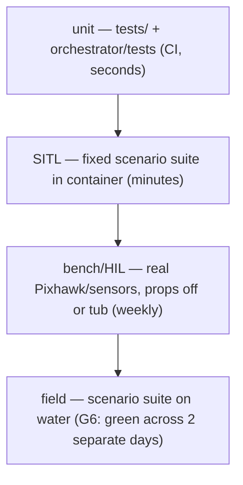

# `tests/` — unit tests for the target system (`rx26_asv/` package)

Pure-Python unit tests for the boat's core logic — no ROS, no hardware, no Docker needed.
They run on any dev machine (`python -m pytest tests -q`) and in CI on every push. Tests for
the autoresearch harness live separately in `orchestrator/tests/` (orchestrator-vs-target
boundary applies to tests too).

**Design choice:** node files are split into ROS-wrapper (`*_node.py`) and pure-logic core
(`*_core.py`, `planner.py`, `drop_latch.py` …) precisely so the safety-relevant math is
testable at this tier of the pyramid (plan §6: unit → SITL → bench/HIL → field).

## What guards what

| Test | Guards | Objective |
|---|---|---|
| `test_drop_latch.py` | autonomy-drop state machine: fail-safe start, latched trip, explicit-reset-only | safety |
| `test_geo.py`, `test_gen_udev.py` | geodesy math; udev rule generation | infra |
| `test_depth_association.py`, `test_pipeline_stats.py`, `test_eval_metrics.py` | bbox→depth→BODY projection (invalid depth = dropped, never zero); fps/latency budgets; retrain regression gate | 1 |
| `test_occupancy_core.py` | decay, comms-cell persistence, perception-can't-overwrite-keep-out | 1, M4 |
| `test_apf_core.py` | APF vectors, trap detection, 10 m moving-hazard rule, equilibrium > AVOID_MARGIN | 1, 2 |
| `test_fence_core.py` | keep-out → MAVLink fence with mandatory readback | 1, M4 |
| `test_progress_monitor.py` | at-risk flag fires BEFORE stall | 2 |
| `test_planner.py`, `test_robocomms_integration.py` | task stack, interrupt/resume fidelity, FIFO'd concurrent requests, byte-identical comms framing, malformed-frame survival | 3, M4 |
| `test_config_shared.py` | **anti-drift**: YAML anchors ↔ ApfParams ↔ monitor kwargs ↔ evaluator thresholds must agree — fails the build if config and code diverge | all |

## Where this tier sits

A change is never promoted on a single green tier: unit green earns a SITL run, SITL green
earns bench time, bench green earns water time.

## Conventions

- Add a test in the **same commit** as the logic it guards; regression tests are named for
  the audit finding or failure they pin (see Phase 4.1 list in `README_PHASE0.md`).
- Keep tests hardware-free: anything needing a device belongs in bench procedures
  (`docs/G1_bench_procedure.md`, `docs/G2_bench_procedure.md`), not here.
