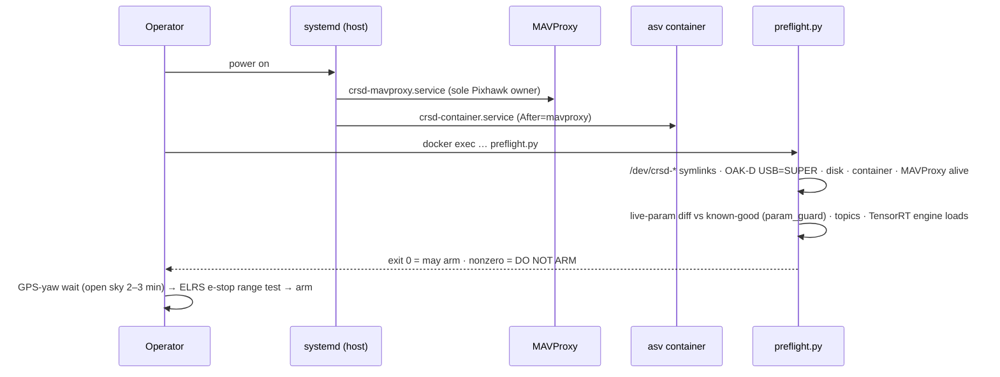

# `tools/` — host tooling, bench utilities, training, device config

Everything here runs *outside* the ROS graph: host-side plumbing (udev/systemd), operator
tools (preflight, param_guard, rebuild), the mock RoboCommand server, and the model-training
pipeline. Plan §9–10.

## Module map

| Dir | Contents | Design intent |
|---|---|---|
| `udev/` | `99-crusader.rules` (VID-based fallback/perms), `gen_udev_rules.py` + generated `99-crusader-devpath.rules` (port-chain matched `/dev/crsd-*` symlinks), `install_udev.sh` | Stable device names resolved by the kernel at plug time; immune to JetPack controller-prefix renames. **Each device must stay on its labeled hub port.** Regenerate after any cabling change. |
| `systemd/` | `crsd-mavproxy.service`, `crsd-container.service` | Boot chain encodes the single-Pixhawk-owner rule: MAVProxy starts first and is the only serial owner; the container starts after. |
| `scripts/` | `preflight.py` (do-not-arm gate: symlinks, USB SUPER, param diff, engine load, topic liveness), `param_guard.py` (PROTECTED vs TUNABLE param diff — used by preflight AND the Level-1 evaluator), `rebuild.sh` (the one blessed rebuild), `extract_sitl_params.py`, `collect_footage.py` (G2 retrain capture) | One true path for each operation, shared by humans and autoresearch identically — no drift between "how a person rebuilds" and "how Level 2 rebuilds". |
| `sim/` | `mock_robocommand.py` — scripted/interactive event injector (assistance request, keep-out, moving object, All Clear) over TCP with competition framing | Byte-identical to the real link so comms code is exercised fully before the venue. |
| `training/` | `prep_dataset.py` (session-level splits — leakage guard), `train_buoy.py` (fine-tune + per-Jetson engine export), `eval_regression.py` (per-class P/R gate, exits nonzero on fail) | Objective-1 metrics are untrusted until the model is retrained on Crusader's own buoys (G2). |
| `bench/` | `g2_error_logger.py` — position-error vs RTK truth | The G2 sign-off instrument. |

## Sequence: operator day-of boot (plan §7)

## Change-impact map

| If you edit… | Re-run / re-do | Affects |
|---|---|---|
| `udev/gen_udev_rules.py` or device JSON | regenerate rules, `sudo bash tools/udev/install_udev.sh`, replug, `tests/test_gen_udev.py` | every device open on the boat; preflight symlink checks |
| `systemd/*.service` | `sudo setup/install_jetson_host.sh` (reinstalls + daemon-reload) | boot ordering — MAVProxy-first is safety-relevant |
| `scripts/param_guard.py` PROTECTED list | `pytest tests/` + review vs CLAUDE.md safety params | what autoresearch is ALLOWED to touch — changes need safety review |
| `scripts/preflight.py` | run it on bench | the do-not-arm gate; add new topics when nodes join `core.launch.py` |
| `scripts/rebuild.sh` | run on Jetson once | humans AND Level-2 validate use it — keep them identical |
| `sim/mock_robocommand.py` framing | `tests/test_robocomms_integration.py` (byte-identical loopback) | Mission-4 comms compliance testing fidelity |
| `training/*` | `eval_regression.py` on held-out sessions | objective-1 trustworthiness (G2) |
